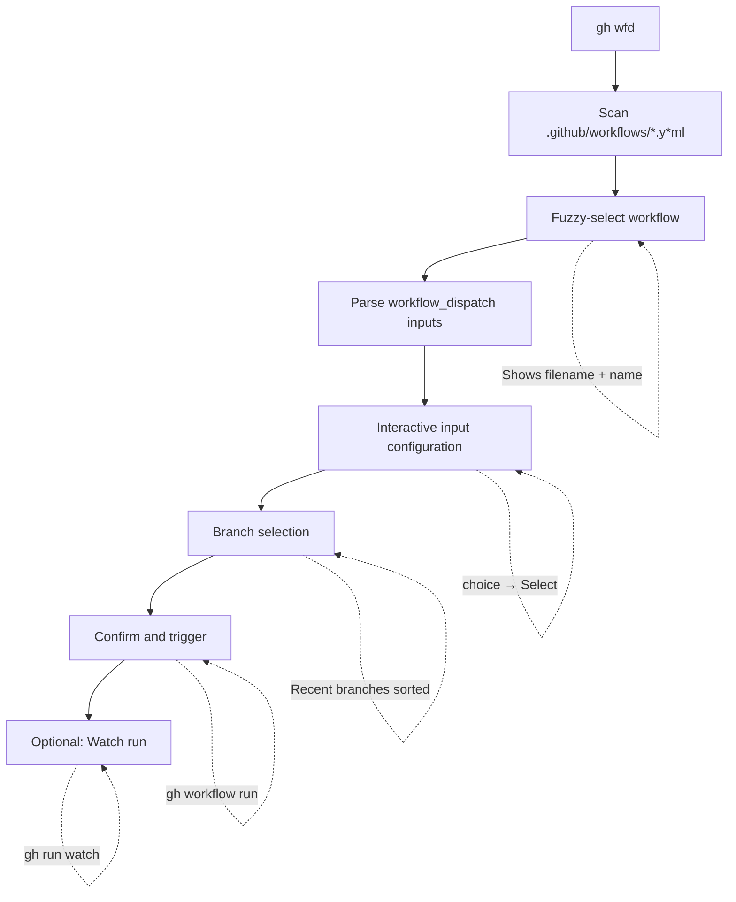

# Contributing to gh-wfd

## Architecture

### Core Flow



### Input Type Mapping

| `workflow_dispatch` input type | TUI Component |
|-------------------------------|---------------|
| `string` (default) | Text input |
| `boolean` | Confirm |
| `choice` | Select with options |
| `environment` | Select with repo environments |

## Design Decisions

### TUI Architecture: Sequential Prompts

The project uses **sequential prompts** (Bubbletea with modal stack) rather than a full-screen dashboard:

**Rationale:**
- Simpler mental model: one decision at a time
- Easier to implement and maintain
- Better accessibility
- Clearer focus on current task
- Modal stack allows lazy-git style navigation (ESC to go back)

**Alternative considered:** Single-screen dashboard with split panes showing workflow list + input form + branch selector simultaneously. Deferred to v2 as it requires more complex state management without clear UX benefits for the primary use case.

### Library Choices

**charmbracelet/bubbles** for lists:
- Built-in fuzzy filtering via sahilm/fuzzy
- Pagination and navigation
- Minimal boilerplate

**charmbracelet/bubbletea** for TUI:
- Elm architecture (Model-Update-View)
- Composable components
- No external dependencies (fzf, etc.)

**go-gh/v2** for GitHub integration:
- Native API access with inherited auth
- Repository detection
- Command execution

### Frecency Algorithm

Score combines frequency (run count) and recency (time since last run):

```
Score = (run_count) × (recency_weight)

recency_weight =
  4.0  if < 1 hour ago
  2.0  if < 24 hours ago
  1.0  if < 1 week ago
  0.5  otherwise
```

This prioritizes workflows that are both frequently used AND recently used, matching user mental models better than pure frequency or recency alone.

**Storage:** JSON file at `~/.local/share/gh-wfd/history.json` following XDG Base Directory spec. Each entry includes:
- Repository path
- Workflow filename
- Branch used
- Input values
- Run count
- Last run timestamp

**SQLite considered but deferred:** Would provide efficient queries for large histories but adds CGO dependency and binary size. Current JSON approach handles hundreds of entries with negligible performance impact.

## File Structure

```
gh-wfd/
├── main.go                    # Entry point, CLI setup
├── internal/
│   ├── app/                   # Main TUI application
│   │   ├── app.go            # Bubbletea app model
│   │   └── app_test.go
│   ├── workflow/              # Workflow discovery & parsing
│   │   ├── discovery.go      # Find .github/workflows/*.yml
│   │   ├── types.go          # WorkflowFile, WorkflowInput structs
│   │   └── parser.go
│   ├── frecency/              # History & scoring
│   │   └── store.go          # JSON persistence, frecency calc
│   ├── ui/                    # TUI components
│   │   ├── panes/            # Main view panes
│   │   │   ├── workflow.go   # Workflow list pane
│   │   │   ├── history.go    # Recent runs pane
│   │   │   └── config.go     # Input configuration pane
│   │   ├── modal/            # Modal dialogs
│   │   │   ├── stack.go      # Modal stack manager
│   │   │   ├── select.go     # Branch/option selection
│   │   │   ├── input.go      # Text input
│   │   │   ├── confirm.go    # Boolean confirmation
│   │   │   └── help.go       # Help screen
│   │   ├── styles.go         # Lipgloss styles
│   │   └── theme/            # Catppuccin themes
│   └── runner/               # Workflow execution
│       └── execute.go        # gh workflow run invocation
├── testdata/                  # Sample workflows for testing
└── .github/
    ├── workflows/
    │   └── release.yml       # goreleaser with gh-extension-precompile
    └── assets/
        └── demo.tape         # VHS recording script
```

## Development

### Building

```bash
go build -o gh-wfd
```

### Testing

```bash
go test ./...
```

Test against sample workflows in `testdata/`:
```bash
cd testdata
../gh-wfd
```

### Recording Demo

Generate demo GIF using VHS:
```bash
vhs < .github/assets/demo.tape
```

### Release Process

Releases are automated via goreleaser:
1. Tag version: `git tag v1.0.0`
2. Push: `git push origin v1.0.0`
3. GitHub Actions builds binaries for multiple platforms
4. Creates GitHub release with artifacts

## YAML Parsing

The `workflow_dispatch` schema has well-defined structure:

```go
type WorkflowFile struct {
    Name string `yaml:"name"`
    On   struct {
        WorkflowDispatch *struct {
            Inputs map[string]WorkflowInput `yaml:"inputs"`
        } `yaml:"workflow_dispatch"`
    } `yaml:"on"`
}

type WorkflowInput struct {
    Description string   `yaml:"description"`
    Required    bool     `yaml:"required"`
    Default     string   `yaml:"default"`
    Type        string   `yaml:"type"`    // string|boolean|choice|number|environment
    Options     []string `yaml:"options"` // for choice type
}
```

### Edge Cases Handled

1. **`on` as string vs map**: `on: push` vs `on: { workflow_dispatch: ... }`
2. **Boolean quirk**: GitHub converts booleans to strings in `github.event.inputs`, preserved in `inputs` context
3. **Missing type**: Defaults to `string` when `type` omitted
4. **Environment type**: Requires API call to fetch repo environments (not yet implemented)

## References

- [Creating GitHub CLI extensions](https://docs.github.com/en/github-cli/github-cli/creating-github-cli-extensions)
- [go-gh library](https://pkg.go.dev/github.com/cli/go-gh/v2)
- [charmbracelet/bubbles](https://pkg.go.dev/github.com/charmbracelet/bubbles)
- [charmbracelet/bubbletea](https://github.com/charmbracelet/bubbletea)
- [gh workflow run manual](https://cli.github.com/manual/gh_workflow_run)
- [workflow_dispatch input types](https://github.blog/changelog/2021-11-10-github-actions-input-types-for-manual-workflows/)
- [Atuin shell history](https://atuin.sh/) - frecency inspiration
- [gh-extension-precompile action](https://github.com/cli/gh-extension-precompile)
